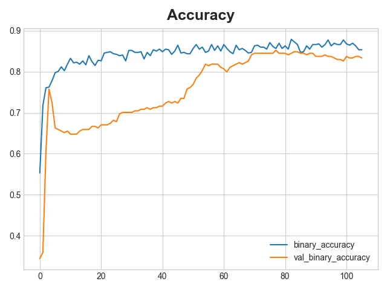

# Titanic Survival Prediction: Deep Learning Approach

## Descripción
Este proyecto aborda la clásica competición de Kaggle sobre el Titanic utilizando un enfoque de **Deep Learning** con TensorFlow/Keras. Este análisis se centra en la inspección detallada del dataframe de entrenamiento (en especial para los ´features´ de Tickets y Cabinas) para alimentar una Red Neuronal Densa.

## >> Tecnologías Utilizadas
- **Python 3**
- **TensorFlow / Keras:** Construcción del modelo de red neuronal.
- **Scikit-Learn:** Preprocesamiento (OneHotEncoder, SimpleImputer) y Pipelines.
- **Pandas & NumPy:** Manipulación de datos.

## >> Arquitectura del Modelo
El modelo es una Red Neuronal Secuencial (Feed-Forward) diseñada para evitar el sobreajuste (Overfitting) en un dataset pequeño:
- **Input Layer:** Preprocesamiento mediante `ColumnTransformer`.
- **Hidden Layers:** Capas densas con activación `elu` (cuya eficacia supera a ´relu´).
- **Regularización:** Uso intensivo de `BatchNormalization` y `Dropout (0.3)` para robustez.
- **Output Layer:** Activación `Sigmoid` para clasificación binaria.

## >> Feature Engineering (Ingeniería de Características)
Uno de los puntos clave de este notebook es el tratamiento de variables categóricas complejas:
1.  **Tickets:** Se identificaron tickets compartidos (familias/grupos de conocidos) y se agruparon los tickets únicos o con frecuencias de aparición debajo de 4, bajo la etiqueta `Other_ticket` para reducir la dimensionalidad. Se ha observado una correspondencia entre la probabilidad de supervivencia y el ticket en común.
2.  **Cabinas:** Estrategia similar para reducir el ruido de las cabinas con aparición única. También se ha observado una correlación entre la tasa de superviviencia y el número de cabina.
3.  Los elementos numéricos desconocidos son reemplazados por el valor medio mediante la imputación, y los categóricos mediante one hot encoder.

## >> Resultados del Entrenamiento
El modelo utiliza **Early Stopping** para detener el entrenamiento cuando la pérdida de validación deja de mejorar, asegurando el mejor modelo posible. Se ha utilizado el mecanismo ´adam´ para optimizar el ´learning rate´. La precisión más alta alcanzada por el modelo entrenado con respecto a los datos de validación ha sido del alrededor del 85%.
Este proyecto sirve como introducción al mundo de data science y machine learning y mejoras del modelo son posibles con una experimentación más exhaustiva de los parámetros y la estructura de la red.


*(Gráfica de Binary_Accuracy vs Val_Binary_Accuracy con respecto a iteraciones)*

## >> Cómo ejecutar este proyecto
1. Clonar el repositorio.
2. Instalar las dependencias:
   ```bash
   pip install -r requirements.txt

## >> Autor
**Lorenzo Ji** - *Proyecto personal con recursos proporcionado por Kaggle*
* Perfil de GitHub: https://github.com/Lorsimu
* Correo académico: lorenzo.ji@estudiante.uam.es


